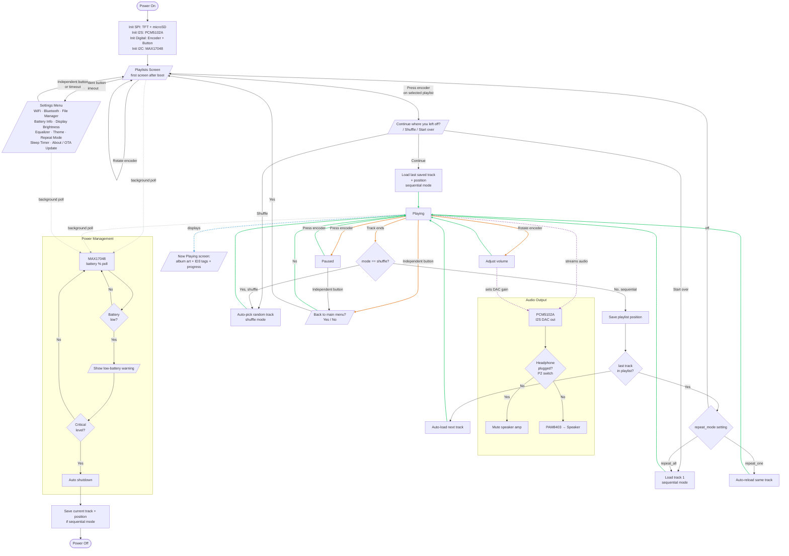
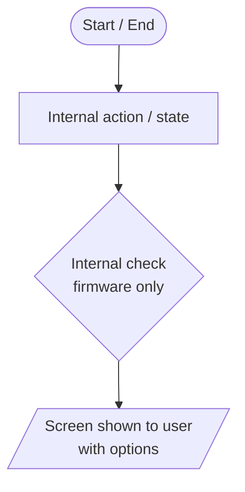
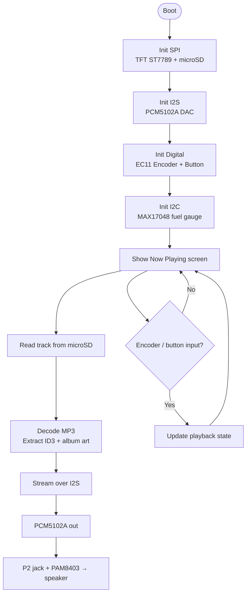

# 🎧 MP3 Player


> **A DIY portable MP3 player built around the ESP32-S3, a 2.4" SPI TFT with an integrated rotary encoder, and a microSD card — with album art, ID3 tags, and battery-powered portability.**

<picture>
  <source media="(prefers-color-scheme: dark)" srcset="https://github.com/user-attachments/assets/5162290e-5001-4da7-8d65-29cf8358a5eb">
  <source media="(prefers-color-scheme: light)" srcset="https://github.com/user-attachments/assets/ef911667-7ad7-4493-9c04-c785970fac2f">
  
</picture>

---

> [!WARNING]
> This project is currently design-only — no hardware has been assembled yet. Everything below describes the intended architecture, not verified behavior.

---

## 📑 Table of Contents

- [Overview](#overview)
- [System Architecture Description](#-system-architecture-description)
- [Hardware](#-hardware)
  - [Bill of Materials](#bill-of-materials)
- [Audio Path](#-audio-path)
- [Storage & Library](#-storage--library)
- [Controls](#️-controls)
- [Display & UI](#️-display--ui)
- [Power](#-power)
- [PinMode](#pinmode)
- [Configuration](#️-configuration)
- [Dependencies](#-dependencies)
- [Roadmap](#roadmap)
- [Contributing](#contributing)
- [License](#-license)

---

## Overview

The player reads MP3 (and eventually other format) files off a **microSD card**, decodes them on the ESP32-S3, and streams the audio out over **I2S to a PCM5102A DAC** — chosen over an integrated-amp chip like the MAX98357A specifically for its higher dynamic range and lower distortion. The DAC's line-level output feeds both a **3.5mm (P2) headphone jack** and a small **Class-D amplifier driving a speaker**.

Navigation is fully physical: an **EC11 rotary encoder** (rotate + push) plus a separate independent button, both built into the same TFT module. The **2.4" ST7789 display** shows the Now Playing screen with embedded **album art and ID3 tags** (title/artist) pulled straight from the MP3 file.

```
microSD → decode (MP3/ID3/album art) → I2S → PCM5102A DAC
                                                   ├── P2 headphone jack
                                                   └── PAM8403 amp → speaker
```

---

## 💻 System Architecture Description

<details>
<summary>Flowchart view</summary>


As the flow became super messy and hard to understand in the ```Playing``` block, i made different strings colors just for this block.

- 🟢 Green — flow returning to Playing (resuming playback)
- 🟠 Orange — flow leaving Playing (into another action or screen)
- 🔵 Blue (dashed) — what gets shown on screen
- 🟣 Purple (dashed) — audio signal path
- ⚪ Gray (dashed) — background battery poll

| Shape | Mermaid syntax | Meaning |
| :--- | :--- | :--- |
| Stadium (rounded) | `([Text])` | Start / End of the whole system (power on/off) |
| Rectangle | `[Text]` | Internal action/state — firmware doing something, nothing shown to the user beyond the current screen |
| Diamond | `{Text}` | **Internal check** — firmware deciding silently (e.g. "is this the last track?"). Never seen by the user. |
| Parallelogram | `[/Text/]` | **Screen shown to the user** — a prompt or message actually displayed on the TFT, with options they pick |



</details>

---

## 🔊 Hardware

### Bill of Materials

| Component | Description | Qty | Notes |
| :--- | :--- | :---: | :--- |
| ESP32-S3 | Main microcontroller | 1 | Handles decode + I2S + display + SD, all in parallel |
| TFT + Encoder + Button module | 2.4" ST7789 SPI display (320×240), integrated EC11 rotary encoder, independent push button | 1 | Same PCB also comes in a 1.8" ST7735S (128×160) variant, not used here |
| microSD card module | SPI, stores MP3 files + embedded album art | 1 | |
| PCM5102A | I2S DAC, line-level analog output | 1 | ~106dB dynamic range; chosen over MAX98357A for fidelity |
| PAM8403 | Class-D amplifier | 1 | Drives the speaker from the DAC's line-level output |
| Speaker | 4Ω/8Ω, small enclosure | 1 | |
| 3.5mm (P2) jack, switched | Headphone output | 1 | Switch contact reserved for auto-mute (see [Roadmap](#roadmap)) |
| LiPo battery | 3.7V | 1 | Capacity per enclosure size |
| Charge/protection module w/ fuel gauge | e.g. MAX17048-based | 1 | Reports battery % to the UI |

---

## 🔌 Audio Path

The **PCM5102A** receives digital audio over I2S and outputs a clean analog line-level signal (2Vrms), which is tapped in two places:

1. Directly into the **P2 headphone jack**
2. Into a **PAM8403** Class-D amp, which drives the **speaker**

> [!NOTE]
> Right now both outputs stay live at the same time. Automatically muting the speaker when a headphone is plugged in — using the jack's own switch contact — is planned, not yet implemented (see [Roadmap](#roadmap)).

---

## 💾 Storage & Library

MP3 files (and their embedded ID3 tags + album art) live on a **microSD card**, read over SPI.

Decoding, I2S output, ID3 parsing, and album art extraction are all handled by a single library: **[ESP32-audioI2S](https://github.com/schreibfaul1/ESP32-audioI2S)** (schreibfaul1) — chosen specifically because it covers the whole SD → decode → I2S → metadata pipeline without stitching together separate libraries for each piece.

---

## 🎛️ Controls

| Input | Action (planned) |
| :--- | :--- |
| Rotate encoder | Navigate tracks / adjust volume |
| Press encoder | Play / pause |
| Independent button | Secondary action (exact mapping still TBD) |

> [!NOTE]
> The display has no touch capability — navigation is 100% physical, via the EC11 encoder and its companion button.

---

## 🖥️ Display & UI

The **Now Playing** screen is the primary view:

- Embedded **album art**, decoded straight from the MP3's ID3 tag
- **Title / artist** metadata
- Playback progress

Folder/playlist browsing and a battery percentage indicator are planned additions — see [Roadmap](#roadmap).

---

## 🔋 Power

Powered by a **LiPo battery** through a charge/protection module with an integrated **fuel gauge** (MAX17048-class), which will report battery percentage to the UI once implemented.

---

## PinMode

> [!NOTE]
> No hardware has been wired yet — this is a **suggested** pin assignment, safe for the ESP32-S3 (avoids strapping and USB pins). Adjust freely once you're actually wiring it up.

| GPIO | Function | Peripheral | Bus | Notes |
| --- | --- | --- | --- | --- |
| 11 | MOSI | TFT (ST7789) + microSD | SPI (shared) | |
| 12 | SCLK | TFT (ST7789) + microSD | SPI (shared) | |
| 10 | CS | TFT (ST7789) | SPI | |
| 6 | CS | microSD | SPI | Separate CS from TFT, same bus |
| 9 | DC | TFT (ST7789) | SPI | |
| 8 | RST | TFT (ST7789) | SPI | |
| 7 | BL | TFT Backlight | PWM | |
| 13 | BCK | PCM5102A | I2S | |
| 14 | LRCK | PCM5102A | I2S | |
| 21 | DIN | PCM5102A | I2S | |
| 4 | CLK | EC11 Rotary Encoder | Digital | |
| 5 | DT | EC11 Rotary Encoder | Digital | |
| 15 | SW | EC11 Encoder (push) | Digital | |
| 16 | — | Independent Button | Digital | |
| 17 | SDA | MAX17048 (fuel gauge) | I2C | |
| 18 | SCL | MAX17048 (fuel gauge) | I2C | |
| 2 | — | P2 jack switch (headphone detect) | Digital | Reserved — auto-mute (Roadmap) |

<details>
<summary>Boot flowchart</summary>



</details>

---

## ⚙️ Configuration

```cpp
#define SD_CS_PIN      6
#define TFT_CS_PIN     10
#define TFT_DC_PIN     9
#define TFT_RST_PIN    8
#define TFT_BL_PIN     7

#define I2S_BCK_PIN    13
#define I2S_LRCK_PIN   14
#define I2S_DOUT_PIN   21

#define ENCODER_CLK    4
#define ENCODER_DT     5
#define ENCODER_SW     15
#define BUTTON_PIN     16

#define DEFAULT_VOLUME 70   // 0–100
```

> [!CAUTION]
> These pin assignments are a starting point, not verified on real hardware yet. Double-check against your actual wiring before flashing.

---

## 📦 Dependencies

- [ESP32-audioI2S](https://github.com/schreibfaul1/ESP32-audioI2S) — MP3 decode, I2S output, ID3 tags, embedded album art
- [TFT_eSPI](https://github.com/Bodmer/TFT_eSPI) — ST7789 display driver
- [AiEsp32RotaryEncoder](https://github.com/igorantolic/ai-esp32-rotary-encoder) — EC11 encoder handling
- [SparkFun MAX1704x Fuel Gauge Arduino Library](https://github.com/sparkfun/SparkFun_MAX1704x_Fuel_Gauge_Arduino_Library) — battery percentage

> [!IMPORTANT]
> Library versions are not pinned. If a dependency updates and breaks the build, lock versions in your package manager.

---

## Roadmap

> [!NOTE]
> None of the items below are implemented yet — this is a planning list for future versions, not current behavior. In fact, no hardware has been assembled at all yet.

| Milestone | Target | Status |
| :---: | :--- | :---: |
| M1 | Assemble physical hardware (currently design-only) | 🔲 Planned |
| M2 | Auto-mute speaker when headphone is plugged in (P2 jack switch) | 🔲 Planned |
| M3 | Folder/playlist navigation on-screen | 🔲 Planned |
| M4 | Battery percentage indicator in the UI (via MAX17048) | 🔲 Planned |
| M5 | Shuffle / repeat modes | 🔲 Planned |
| M6 | Simple equalizer (bass/treble) | 🔲 Planned |
| M7 | Bluetooth A2DP output (in addition to wired) | 🔲 Planned |
| M8 | Support for more formats (WAV, FLAC — beyond MP3) | 🔲 Planned |
| M9 | Resume playback from where it stopped after power-off | 🔲 Planned |
| M10 | Low-battery warning / automatic shutdown | 🔲 Planned |
| M11 | OTA firmware updates over WiFi | 🔲 Planned |
| M12 | Customizable UI themes | 🔲 Planned |

---

## Contributing

Contributions are very welcome — hardware wiring feedback, firmware improvements, UI ideas, docs, anything.

1. Fork the repo
2. Create a feature branch: `git checkout -b feat/your-feature`
3. Commit your changes: `git commit -m "feat: describe your change"`
4. Push and open a Pull Request against `main`

Please open an issue first for anything larger than a bug fix, so we can discuss direction before you invest time building it.

> [!IMPORTANT]
> When contributing firmware changes, always test on real hardware before submitting a PR — I2S timing, SD read speed, and display refresh behavior can differ significantly from simulated builds.

---

## 📄 License

This project is licensed under the **MIT License**. See [LICENSE](./LICENSE) for the full text.

---
